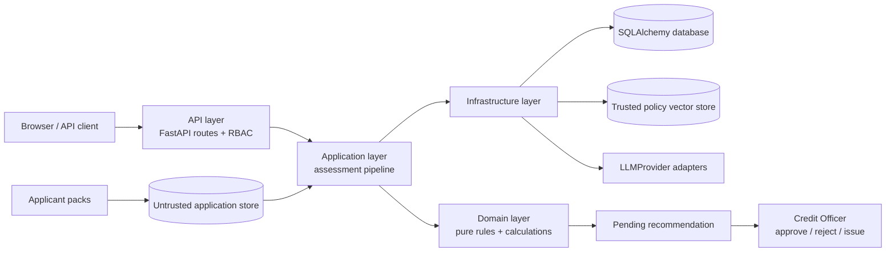

# Architecture Design

## System boundary and layer ownership

Credit Copilot Lite is a deliberately constrained credit-assessment system. The design uses clean, layered architecture to make a useful distinction enforceable: domain decisions are deterministic; infrastructure integrations are replaceable; an LLM is an untrusted drafting and extraction dependency rather than a decision-maker.

The dependency direction is intentional. `src/domain` imports neither an LLM SDK nor a vector database client. `src/application` orchestrates use cases and is the only layer that coordinates extraction, retrieval, rule evaluation, and memo construction. `src/infrastructure` owns provider adapters, persistence, ingestion, and retrieval mechanics. The FastAPI layer validates transport concerns and applies authentication; it does not calculate affordability.

## Assessment pipeline and trust boundaries

The application pipeline receives a seeded application identifier, loads its pack, validates required form fields, removes protected attributes, selects the policy edition, verifies extracted evidence, retrieves policy clauses, evaluates rules, calculates affordability, and creates a recommendation. Applications remain `pending_approval`; a human Credit Officer alone can transition them to `approved` or `rejected`, followed by `issued` only after approval.

Policy material and applicant material never share a retrieval collection. The trusted collection contains official policy sources only. Applicant packs are stored as untrusted content and cannot answer a policy question. Before any external LLM call, National IDs and telephone numbers are masked, and applicant text is bounded with `<untrusted_document>` tags so it cannot be interpreted as system instruction.

## Clause-based chunking

`src/infrastructure/ingestion/chunker.py` creates semantic chunks aligned to policy sections and clauses (for example, CP-4.1 or PM-2), retaining source file, page, clause ID, policy edition, and effective-date metadata. This is materially safer than fixed-length token splitting:

- a clause preserves its qualifiers, thresholds, exceptions, and citation context;
- edition filtering selects the applicable source before an answer is drafted;
- stable clause metadata provides an auditable citation and prevents a plausible adjacent paragraph from being represented as the governing rule.

Naive windows are appropriate for broad semantic discovery but are weak for regulated policy text: they can split a condition from its exception or blend adjacent editions. The ingestion pipeline therefore favors semantic boundaries and source-derived storage IDs.

## Deterministic policy edition selection

`select_policy_edition()` in `src/application/validation.py` maps the submitted application date to the active policy without an LLM call. Applications dated on or after 2025-03-01 use `CP-2025`; applications from 2024-08-01 through 2025-02-28 use `CP-2024`; earlier dates raise `PolicyEditionNotFound`.

This is executable policy control, not prompt guidance. It eliminates a class of silent failures in which a model selects a more favorable or more familiar edition.

## Arithmetic isolation

All financial values are computed in `src/domain/calculations.py`. The reducing-balance monthly installment is calculated as `P × r / (1 - (1 + r)^-n)`; DBR combines verified obligations and that computed installment; maximum eligible amount is derived from the permitted payment capacity and floored to the policy granularity. Product limits and age-at-maturity checks are also deterministic.

The LLM never receives responsibility for arithmetic. `src/application/pipeline.py` supplies code-derived values to the memo stage, and the provider can only explain those supplied values. This prevents rounding drift, fabricated rates, and calculations that cannot be reproduced from the application record.

## Fairness and protected attributes

`src/application/anonymizer.py` removes `gender`, `marital_status`, `religion`, and `nationality` before an LLM receives application data. The removal is pure Python, occurs before extraction, and is recorded by the pipeline. The `test_fairness` coverage submits otherwise identical applications with different protected attributes and asserts identical calculations and recommendation output. The guardrail applies both to structured form data and the LLM input boundary.

## Provider adapters

The provider seam is `LLMProvider` in `src/infrastructure/llm/base.py`. To add a provider, implement that interface in a new adapter, load prompts through `prompt_loader.py` rather than embedding prompt text, register the adapter in `provider_factory.py`, and add the provider-specific environment variables to `.env.example`. Set `LLM_PROVIDER` to the registered provider name; use `fake` for offline deterministic tests. Gemini and Groq are existing examples.

## Honest engineering cuts

The implementation intentionally uses standard retrieval and a fixed assessment pipeline rather than autonomous multi-agent or graph-agent orchestration. This keeps the execution path auditable and testable for a regulated demonstration. It does not yet provide production-grade provider failover, background ingestion jobs, a full document-management UI, or a long-lived evaluation telemetry service. Those are operational enhancements, not substitutes for the deterministic decision controls already in place.
